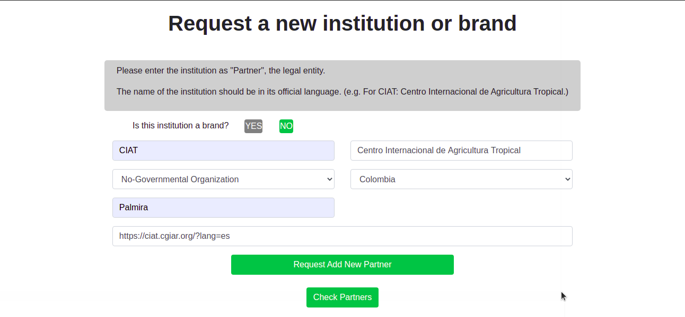
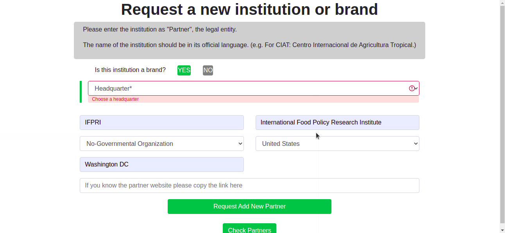
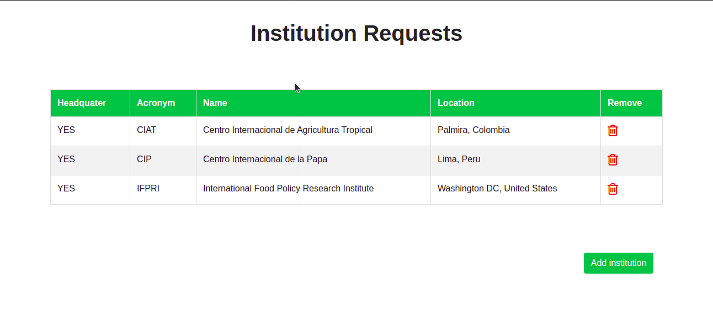

# PARTNERSHIP CIAT

# 

## Description :book:
Register legal entities/organizations that are contributing to some projects at CIAT.

## Installation :floppy_disk:

0. Clone this repository in you local machine. Example:

```console
foo@bar:~$ git clone https://github.com/arturovictoriar/PARTNERSHIP_CIAT.git
```

On Ubuntu:

1. Install Docker and Docker compose, if you have not installed yet

- https://docs.docker.com/engine/install/ubuntu/

- https://docs.docker.com/compose/install/


2. Go inside the PARTNERSHIP_CIAT folder

```console
foo@bar:~$ cd /PARTNERSHIP_CIAT
```

3. execute the docker-compose up

```console
foo@bar:~/PARTNERSHIP_CIAT$ sudo docker-compose up
```

On Windows:

1. Install Docker Destop for Windows, if you have not installed yet

- https://docs.docker.com/docker-for-windows/install/

2. Open power shell like admin

3. Go inside the PARTNERSHIP_CIAT folder

```console
foo@bar:~$ cd /PARTNERSHIP_CIAT
```

4. In power shell, execute docker-compose up

```console
foo@bar:~/PARTNERSHIP_CIAT$ docker-compose up
```

## Usage :open_file_folder:

1. Fill out all the field required



2. Once everything is complete, click on Request Add New Partner. This will take to the Requests Institutions view

3. Also, if click on Check Partner button, you will be able to see the Requests Institutions.

4. If you want to go back to Request a new Institution or Brand view you should click on Add Institution button



## Support :email:

LinkedIn:

- [Arturo Victoria Rincon](https://www.linkedin.com/in/arturovictoriar/)

Twitter:

- [Arturo Victoria Rincon](https://twitter.com/arturovictoriar)

Portfolio website:

- [Arturo Victoria Rincon](http://arturovictoriar.github.io/)

## Authors and acknowledgment :school:

Arturo Victoria Rincon is Mechatronics Engineer with innate leadership and adaptability skills. Focused on developing software to improve people's quality of life using tools such as Python, Javascript, C, and C ++.

## License :warning:

:copyright: 2021 All rights reserved.

## Author :black_nib:

* **Arturo Victoria Rincon** [@arturovictoriar](https://github.com/arturovictoriar)